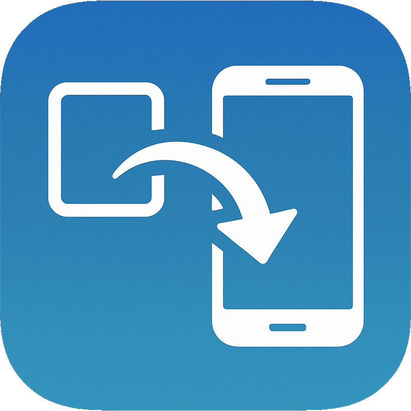

# Vid2Vert

Vid2Vert is a cross-platform desktop application for converting aspect ratios of videos, built with Go, Wails, and a modern Vue.js frontend. It leverages FFmpeg for video processing and provides a user-friendly interface for timeline editing and video preview.
I primarily designed it to convert landscape videos to portrait, but you can use it however you wish.

## Features
- Video aspect ratio conversion and panning
- Timeline editing and video preview
- Cross-platform support: Linux, Windows
- Modern UI built with Vue.js and Vite

## Screenshots


## Getting Started

### Prerequisites
- [Go](https://golang.org/dl/) 1.24+
- [Node.js](https://nodejs.org/) 18+
- [Wails CLI](https://wails.io/docs/gettingstarted/installation)

### Building from Source

1. Clone the repository:
   ```sh
   git clone https://github.com/yourusername/Vid2Vert.git
   cd Vid2Vert
   ```
2. Install frontend dependencies:
   ```sh
   cd frontend
   npm install
   cd ..
   ```
3. Build the application:
   ```sh
   wails build
   ```

### Running the App (Development)
```sh
wails dev
```

## Usage
- Import a video file
- Edit the timeline and preview changes
- Export the processed video

## Contributing
Pull requests are welcome! For major changes, please open an issue first to discuss what you would like to change.

## License
[MIT](LICENSE)

## Acknowledgements
- [Wails](https://wails.io/)
- [Vue.js](https://vuejs.org/)
- [FFmpeg](https://ffmpeg.org/)
